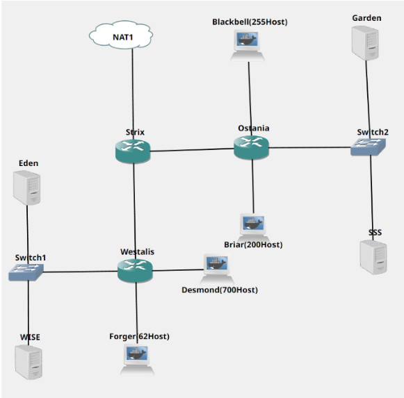

# Jarkom-Modul-5-ITB05-2022
Kelompok ITB05

1. M.Fernando N.Sibarani (5027201015)
2. Richard Nicolas (5027201021)
3. Muhammad Ihsanul Afkar (5027201024)

# Daftar Isi
* [Topologi](#Topologi)
* [Soal 1](#Soal-1) 
* [Soal 2](#Soal-2) 
* [Soal 3](#Soal-3) 
* [Soal 4](#Soal-4) 
* [Soal 5](#Soal-5) 
* [Soal 6](#Soal-6) 

# Topologi
1. Tugas pertama kalian yaitu membuat topologi jaringan sesuai dengan rancangan yang diberikan Loid dibawah ini:

* **Eden** adalah **DNS Server**
* **WISE** adalah **DHCP Server**
* **Garden** dan **SSS** adalah **Web Server**
* Jumlah Host pada **Forger** adalah 62 host
* Jumlah Host pada **Desmond** adalah 700 host
* Jumlah Host pada **Blackbell** adalah 255 host
* Jumlah Host pada **Briar** adalah 200 host

2. Untuk menjaga perdamaian dunia, Loid ingin meminta kalian untuk membuat topologi tersebut menggunakan teknik CIDR atau VLSM setelah melakukan subnetting.
3. Anya, putri pertama Loid, juga berpesan kepada anda agar melakukan Routing agar setiap perangkat pada jaringan tersebut dapat terhubung.
4. Tugas berikutnya adalah memberikan ip pada subnet Forger, Desmond, Blackbell, dan Briar secara dinamis menggunakan bantuan DHCP server. Kemudian kalian ingat bahwa kalian harus setting DHCP Relay pada router yang menghubungkannya.

# Soal-1
Agar topologi yang kalian buat dapat **mengakses** keluar, kalian diminta untuk mengkonfigurasi Strix menggunakan **iptables**, tetapi Loid tidak ingin menggunakan **MASQUERADE**.

# Soal-2
Kalian diminta untuk melakukan drop semua **TCP** dan **UDP** dari luar Topologi kalian pada server yang merupakan **DHCP Server** demi menjaga keamanan.
# Soal-3
Loid meminta kalian untuk membatasi DHCP dan DNS Server hanya boleh menerima maksimal **2 koneksi ICMP** secara bersamaan menggunakan iptables, selebihnya **didrop**
# Soal-4
Akses menuju Web Server hanya diperbolehkan disaat jam kerja yaitu **Senin sampai Jumat** pada pukul **07.00 - 16.00.**
# Soal-5
Karena kita memiliki 2 Web Server, Loid ingin **Ostania** diatur sehingga setiap request dari client yang mengakses **Garden** dengan port 80 akan didistribusikan secara bergantian pada **SSS dan Garden** secara berurutan dan request dari client yang mengakses SSS dengan port 443 akan didistribusikan secara bergantian pada Garden dan SSS secara berurutan.
# Soal-6
Karena Loid ingin tau **paket apa saja** yang di-drop, maka di setiap node server dan router ditambahkan logging paket yang di-drop dengan standard syslog level.

