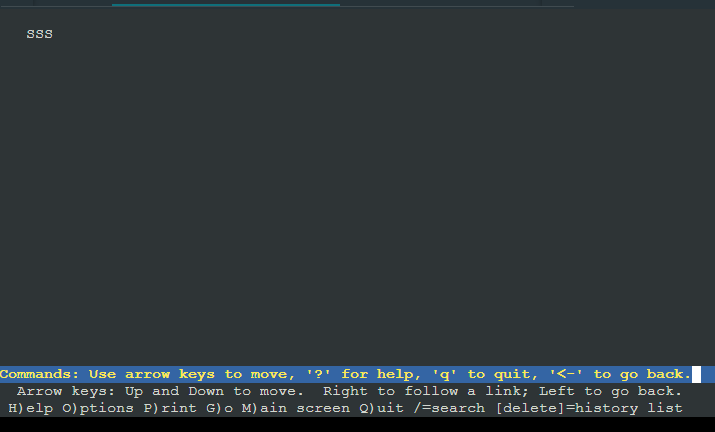

# Jarkom-Modul-5-ITB05-2022
Kelompok ITB05

1. M.Fernando N.Sibarani (5027201015)
2. Richard Nicolas (5027201021)
3. Muhammad Ihsanul Afkar (5027201024)

# Daftar Isi
* [Topologi](#Topologi)
* [Soal 1](#Soal-1) 
* [Soal 2](#Soal-2) 
* [Soal 3](#Soal-3) 
* [Soal 4](#Soal-4) 
* [Soal 5](#Soal-5) 
* [Soal 6](#Soal-6) 
* [Kendala](#Kendala) 

# Topologi
1. Tugas pertama kalian yaitu membuat topologi jaringan sesuai dengan rancangan yang diberikan Loid dibawah ini:


* **Eden** adalah **DNS Server**
* **WISE** adalah **DHCP Server**
* **Garden** dan **SSS** adalah **Web Server**
* Jumlah Host pada **Forger** adalah 62 host
* Jumlah Host pada **Desmond** adalah 700 host
* Jumlah Host pada **Blackbell** adalah 255 host
* Jumlah Host pada **Briar** adalah 200 host

2. Untuk menjaga perdamaian dunia, Loid ingin meminta kalian untuk membuat topologi tersebut menggunakan teknik CIDR atau VLSM setelah melakukan subnetting.
3. Anya, putri pertama Loid, juga berpesan kepada anda agar melakukan Routing agar setiap perangkat pada jaringan tersebut dapat terhubung.
4. Tugas berikutnya adalah memberikan ip pada subnet Forger, Desmond, Blackbell, dan Briar secara dinamis menggunakan bantuan DHCP server. Kemudian kalian ingat bahwa kalian harus setting DHCP Relay pada router yang menghubungkannya.

Berikut ini adalah topologi yang telah kelompok kami buat


Untuk subnetting yang kami gunakan adalah **VLSM** dengan pembagian ip seperti berikut ini 


Berikut ini adalah **konfigurasi network pada setiap node**

[ Strix ]
```
auto eth0
iface eth0 inet dhcp

# Static config for eth1
auto eth1
iface eth1 inet static
	address 10.47.7.253
	netmask 255.255.255.252

auto eth2
iface eth2 inet static
	address 10.47.7.249
	netmask 255.255.255.252
```
[ Westalis ]
```
auto eth0
iface eth0 inet static
	address 10.47.7.250
	netmask 255.255.255.252

auto eth1
iface eth1 inet static
	address 10.47.7.241
	netmask 255.255.255.248

auto eth2
iface eth2 inet static
	address 10.47.0.1
	netmask 255.255.252.0

auto eth3
iface eth3 inet static
	address 10.47.7.129
	netmask 255.255.255.192
```
[ Ostania ]
```
auto eth0
iface eth0 inet static
	address 10.47.7.254
	netmask 255.255.255.252

auto eth1
iface eth1 inet static
	address 10.47.7.225
	netmask 255.255.255.248

auto eth2
iface eth2 inet static
	address 10.47.4.1
	netmask 255.255.254.0

auto eth3
iface eth3 inet static
	address 10.47.6.1
	netmask 255.255.255.0
```
[ Eden ]
```
auto eth0
iface eth0 inet static
	address 10.47.7.242
	netmask 255.255.255.248
	gateway 10.47.7.241
```
[ WISE ]
```
auto eth0
iface eth0 inet static
	address 10.47.7.243
	netmask 255.255.255.248
	gateway 10.47.7.241
```
[ Garden ]
```
# A9
auto eth0
iface eth0 inet static
	address 10.47.7.226
	netmask 255.255.255.248
	gateway 10.47.7.225
```
[ SSS ]
```
# A9
auto eth0
iface eth0 inet static
	address 10.47.7.227
	netmask 255.255.255.248
	gateway 10.47.7.225
```
[ Blackbell ] [ Briar ] [ Desmond ] [ Forger ]
```
auto eth0
iface eth0 inet dhcp
```

Dibawah ini adalah setting Router agar semua rute dapat terhubung
```
# Ke Ostania
route add -net 10.47.7.224 netmask 255.255.255.248 gw 10.47.7.254 #A1
route add -net 10.47.4.0 netmask 255.255.254.0 gw 10.47.7.254 #A2
route add -net 10.47.6.0 netmask 255.255.255.0 gw 10.47.7.254 #A3
route add -net 10.47.7.252 netmask 255.255.255.252 gw 10.47.7.254 #A4

#Ke Westalis
route add -net 10.47.7.248 netmask 255.255.255.252 gw 10.47.7.250 #A5
route add -net 10.47.0.0 netmask 255.255.252.0 gw 10.47.7.250 #A6
route add -net 10.47.7.128 netmask 255.255.255.192 gw 10.47.7.250 #A7
route add -net 10.47.7.240 netmask 255.255.255.248 gw 10.47.7.250 #A8
```
Pada Router Westalis dimasukkan kode berikut ini untuk rutenya dan DHCP Relaynya
```
route add -net 0.0.0.0 netmask 0.0.0.0 gw 10.47.7.249

echo "nameserver 10.47.7.242" > /etc/resolv.conf

apt update
apt install isc-dhcp-relay -y
echo '
SERVERS="10.47.7.243"
INTERFACES="eth1 eth2 eth3 eth0"
OPTIONS=""
' > /etc/default/isc-dhcp-relay
service isc-dhcp-relay restart
```
Pada Router Ostania dimasukkan kode berikut ini untuk rutenya dan DHCP Relaynya
```
route add -net 0.0.0.0 netmask 0.0.0.0 gw 10.47.7.253

echo "nameserver 10.47.7.242" > /etc/resolv.conf

apt update
apt install isc-dhcp-relay -y
echo '
SERVERS="10.47.7.243"
INTERFACES="eth1 eth2 eth3 eth0"
OPTIONS=""
' > /etc/default/isc-dhcp-relay
service isc-dhcp-relay restart
```
Untuk DHCP Server (**WISE**) di-*setting* 
```
apt-get update
apt-get install isc-dhcp-server -y
echo '
INTERFACES="eth0"
' > /etc/default/isc-dhcp-server

# DHCP A2 A3 A6 A7
# STAT A1 A4 A5 A8
echo '
subnet 10.47.7.224 netmask 255.255.255.248 {}
subnet 10.47.7.252 netmask 255.255.255.252 {}
subnet 10.47.7.248 netmask 255.255.255.252 {}
subnet 10.47.7.240 netmask 255.255.255.248 {}

subnet '10.47.4.0' netmask '255.255.254.0' {
    range '10.47.4.2' '10.47.5.254';
    option routers '10.47.4.1';
    option broadcast-address '10.47.5.255';
    option domain-name-servers '10.47.7.242';
    default-lease-time '720';
    max-lease-time '7200';
}
subnet '10.47.6.0' netmask '255.255.255.0' {
    range '10.47.6.2' '10.47.6.254';
    option routers '10.47.6.1';
    option broadcast-address '10.47.6.255';
    option domain-name-servers '10.47.7.242';
    default-lease-time '720';
    max-lease-time '7200';
}
subnet '10.47.0.0' netmask '255.255.252.0' {
    range '10.47.0.2' '10.47.3.254';
    option routers '10.47.0.1';
    option broadcast-address '10.47.3.255';
    option domain-name-servers '10.47.7.242';
    default-lease-time '720';
    max-lease-time '7200';
}
subnet '10.47.7.128' netmask '255.255.255.192' {
    range '10.47.7.130' '10.47.7.190';
    option routers '10.47.7.129';
    option broadcast-address '10.47.7.191';
    option domain-name-servers '10.47.7.242';
    default-lease-time '720';
    max-lease-time '7200';
}
' > /etc/dhcp/dhcpd.conf
service isc-dhcp-server restart
```
Untuk DNS Server (**Eden**) di-*setting* 
```
echo "nameserver 192.168.122.1" > /etc/resolv.conf

apt update
apt install bind9 -y
echo '
options {
        directory "/var/cache/bind";
        forwarders {
                192.168.122.1;
        };
        allow-query { any; };
        auth-nxdomain no;    # conform to RFC1035
        listen-on-v6 { any; };
};
' > /etc/bind/named.conf.options
service bind9 restart
```
Untuk Web-server (**SSS** dan **Garden**) di-**setting** seperti berikut ini
```
echo "nameserver 10.47.7.242" > /etc/resolv.conf

apt update
apt install apache2 -y
service apache2 start
echo "$HOSTNAME" > /var/www/html/index.html
```
Jika dibuka webnya akan terlihat nama hostnya

Hasilnya semua node dapat ping dengan sesama


# Soal-1
Agar topologi yang kalian buat dapat **mengakses** keluar, kalian diminta untuk mengkonfigurasi Strix menggunakan **iptables**, tetapi Loid **tidak** ingin menggunakan **MASQUERADE**.

Untuk konfigurasi **Strix** menggunakan **iptables**, kami menggunakan perintah seperti berikut ini

```
IPETH0="$(ip -br a | grep eth0 | awk '{print $NF}' | cut -g'/' -f1)"
iptables -t nat -A POSTROUTING -o eth0 -j SNAT --to-source "$IPETH0" -s 10.47.0/21
```
# Soal-2
Kalian diminta untuk melakukan drop semua **TCP** dan **UDP** dari luar Topologi kalian pada server yang merupakan **DHCP Server** demi menjaga keamanan.

Untuk melakukan drop TCP dan UDP ke DHCP server, kami menggunakan perintah atau rules seperti berikut ini pada **Strix**
```
iptables -A FORWARD -d 10.47.7.243 -i eth0 -p tcp -j LOG --log-level 5
iptables -A FORWARD -d 10.47.7.243 -i eth0 -p udp -j LOG --log-level 5

iptables -A FORWARD -d 10.47.7.243 -i eth0 -p tcp -j DROP
iptables -A FORWARD -d 10.47.7.243 -i eth0 -p udp -j DROP
```
# Soal-3
Loid meminta kalian untuk membatasi DHCP dan DNS Server hanya boleh menerima maksimal **2 koneksi ICMP** secara bersamaan menggunakan iptables, selebihnya **didrop**

Setting yang kami lakukan adalah sebagai berikut (Pada **DNS Server Eden**)
```
iptables -A INPUT -p icmp -m connlimit --connlimit-above 2 --connlimit-mask 0 -j LOG --log-level 5

iptables -A INPUT -p icmp -m connlimit --connlimit-above 2 --connlimit-mask 0 -j DROP

service rsyslog restart
```
Setting yang kami lakukan adalah sebagai berikut (Pada **DHCP Server WISE**)
```
iptables -A INPUT -p icmp -m connlimit --connlimit-above 2 --connlimit-mask 0 -j LOG --log-level 5

iptables -A INPUT -p icmp -m connlimit --connlimit-above 2 --connlimit-mask 0 -j DROP

service rsyslog restart
```
Hasilnya


 


# Soal-4
Akses menuju Web Server hanya diperbolehkan disaat jam kerja yaitu **Senin sampai Jumat** pada pukul **07.00 - 16.00.**

Kami setting iptables berikut ini pada **Ostania** sehingga akses selain senin sampai jumat dan diluar rentang jam tersebut akan di-*reject*
```
iptables -A FORWARD -d 10.47.7.243 -m time --weekdays Sat,Sun -j LOG --log-level 5
iptables -A FORWARD -d 10.47.7.243 -m time --timestart 00:00 --timestop 06:59 --weekdays Mon,Tue,Wed,Thu,Fri -j LOG --log-level 5
iptables -A FORWARD -d 10.47.7.243 -m time --timestart 16:01 --timestop 23:59 --weekdays Mon,Tue,Wed,Thu,Fri -j LOG --log-level 5

iptables -A FORWARD -d 10.47.7.226 -m time --weekdays Sat,Sun -j LOG --log-level 5
iptables -A FORWARD -d 10.47.7.226 -m time --timestart 00:00 --timestop 06:59 --weekdays Mon,Tue,Wed,Thu,Fri -j LOG --log-level 5
iptables -A FORWARD -d 10.47.7.226 -m time --timestart 16:01 --timestop 23:59 --weekdays Mon,Tue,Wed,Thu,Fri -j LOG --log-level 5


iptables -A FORWARD -d 10.47.7.243 -m time --weekdays Sat,Sun -j REJECT
iptables -A FORWARD -d 10.47.7.243 -m time --timestart 00:00 --timestop 06:59 --weekdays Mon,Tue,Wed,Thu,Fri -j REJECT
iptables -A FORWARD -d 10.47.7.243 -m time --timestart 16:01 --timestop 23:59 --weekdays Mon,Tue,Wed,Thu,Fri -j REJECT

iptables -A FORWARD -d 10.47.7.226 -m time --weekdays Sat,Sun -j REJECT
iptables -A FORWARD -d 10.47.7.226 -m time --timestart 00:00 --timestop 06:59 --weekdays Mon,Tue,Wed,Thu,Fri -j REJECT
iptables -A FORWARD -d 10.47.7.226 -m time --timestart 16:01 --timestop 23:59 --weekdays Mon,Tue,Wed,Thu,Fri -j REJECT
```
Hasilnya jika diluar waktu yang di-*setting*


Hasilnya jika dalam waktu yang di-*setting*



# Soal-5
Karena kita memiliki 2 Web Server, Loid ingin **Ostania** diatur sehingga setiap request dari client yang mengakses **Garden** dengan port 80 akan didistribusikan secara bergantian pada **SSS dan Garden** secara berurutan dan request dari client yang mengakses SSS dengan port 443 akan didistribusikan secara bergantian pada Garden dan SSS secara berurutan.

Berikut ini adalah setting yang kami lakukan pada **Ostania** sebagai router penghubung webserver
```
iptables -A PREROUTING -t nat -p tcp -d 10.47.7.226 --dport 80 -m statistic --mode nth --every 2 --packet 0 -j DNAT --to-destination 10.47.7.226:80
iptables -A PREROUTING -t nat -p tcp -d 10.47.7.226 --dport 80 -j DNAT --to-destination 10.47.7.227:80

iptables -A PREROUTING -t nat -p tcp -d 10.47.7.227 --dport 443 -m statistic --mode nth --every 2 --packet 0 -j DNAT --to-destination 10.47.7.227:443
iptables -A PREROUTING -t nat -p tcp -d 10.47.7.227 --dport 443 -j DNAT --to-destination 10.47.7.226:443
```

Hasilnya jika melakukan **dua** kali lynx pada `10.47.7.242`


# Soal-6
Karena Loid ingin tau **paket apa saja** yang di-drop, maka di setiap node server dan router ditambahkan logging paket yang di-drop dengan standard syslog level.

Untuk melihat packet apa saja yang di-*drop*, kami menggunakan perintah `LOG --log-level 5` pada akhir perintah saat akan di-*drop*

Contohnya pada DHCP Server(**WISE**) dan DNS Server(**Eden**): 
```
iptables -A INPUT -p icmp -m connlimit --connlimit-above 2 --connlimit-mask 0 -j LOG --log-level 5

iptables -A INPUT -p icmp -m connlimit --connlimit-above 2 --connlimit-mask 0 -j DROP
```

# Kendala
Tidak ada
